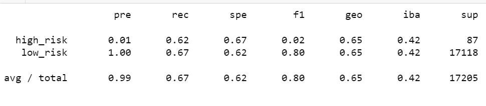

# ChallengeModule_18-Supervised-Machine-Learning-and-Credit-Risk

ChallengeModule_18-Supervised-Machine-Learning-and-Credit-Risk

## Overview

Use `imbalanced-learn` and `scikit-learn` libraries to build and evaluate models using resampling.

Using the credit card credit dataset from LendingClub, a peer-to-peer lending services company, you’ll oversample the data using the `RandomOverSampler` and `SMOTE` algorithms, and undersample the data using the `ClusterCentroids` algorithm. Then, you will use a combinatorial approach of over- and undersampling using the `SMOTEENN` algorithm. Next, you’ll compare two new machine learning models that reduce bias, `BalancedRandomForestClassifier` and `EasyEnsembleClassifier`, to predict credit risk. (From Module Challenge Page)

## Analysis Results

* Naive Random Oversampling
  * The Accuracy Score is 64.71%
  * The Imbalanced Classification Report

* SMOTE Oversampling
  * The Accuracy Score is 62.52%
  * The Imbalanced Classification Report

* Undersampling
  * The Accuracy Score is 52.94%
  * The Imbalanced Classification Report

* Combination (Over and Under) Sampling
  * The Accuracy Score is 64.15%
  * The Imbalanced Classification Report

* Balanced Random Forest Classifier
  * The Accuracy Score is 78.78%
  * The Imbalanced Classification Report

* Easy Ensemble AdaBoost Classifier
  * The Accuracy Score is 92.55%
* The Imbalanced Classification Report

## Summary

Based on the results above the Easy Ensemble AdaBoost Classifier returned the highest accuracy score at 92.55%.  The precision of all the models was 99%, which leaves the Accuracy Score as the sole determining factor on which model to use.   Other accuracy scores fell between 52.94% and 78.78%.  The high over all accuracy and comparatively (to the other models) higher accuracy score of the Easy Ensemble AdaBoost Classifier makes it the most reasonable choice when deciding based solely on the model's reliability and not other external factors not discussed in the module.
